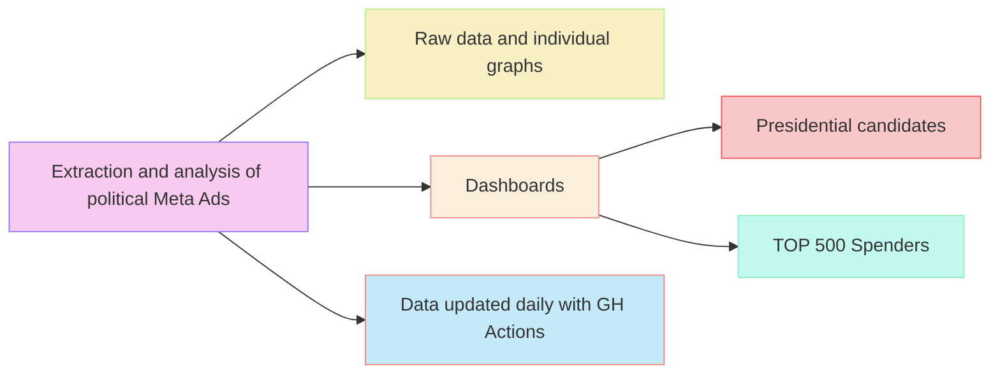

# Transparency International (CZ) election monitoring:   [2023 Czech presidential elections](https://www.transparentnivolby.cz/komunalni-senat2022/)

## Analysis of political advertisement on Meta-owned platforms.

### See [dashboard](https://opop999.github.io/TI_monitoring_fb_political_ads_2023/) with visualizations, [raw data](https://github.com/opop999/TI_monitoring_fb_political_ads_2023/tree/master/output) and [individual graphs](https://github.com/opop999/TI_monitoring_fb_political_ads_2023/tree/master/output/plots).

IMPORTANT: 
There are **two interlinked dashboard versions**. The **default one** displays stats for **top Facebook Ads spenders** (out of a pool of TOP 500 based on FB Ad library report). 
The **filtered dashboard version** is narrowed down to the **presidential candidates only** (see their names in the table below). You can **switch** between the dashboards by pressing the *show candidates only / show all* button on the top of the dashboard.

### For a previous similar workflow concerning the 2022 Czech municipal and senate elections, please see its [repository](https://github.com/opop999/TI_monitoring_fb_political_ads_2022) and [dashboard](https://opop999.github.io/TI_monitoring_fb_political_ads_2022/).

### For the 2021 Czech legislative elections workflow, see its [repository](https://github.com/opop999/TI_monitoring_fb_political_ads_2021) and [dashboard](https://opop999.github.io/TI_monitoring_fb_political_ads_2021/).

------------------------------------------------------------------------

**For more information about how to use FB Ads Library API to extract data about political advertising, see the [following chapter](https://bookdown.org/paul/apis_for_social_scientists/facebook-ad-library-api.html):**

> Pekáček, Ondřej (2022). "Facebook Ad Library API" In APIs for social scientists: A collaborative review v1.0, edited by Paul C. Bauer, Camille Landesvatter & Lion Behrens. <https://doi.org/10.5281/zenodo.6798690>

------------------------------------------------------------------------

**Data updated 1x day until the elections.**   **For more information on the analytical process, including its limitations, [please see this document](README_appendix_variables_explained.md).**

------------------------------------------------------------------------

**The main list of official presidential candidates and their Facebook numeric IDs in alphabetic order.**

| **POLITICAL SUBJECT**                | **NUMERIC ID**  |
|:-------------------------------------|:----------------|
|Andrej Babis    |214827221987263  |
|Danuse Nerudova |102845669064210  |
|Jaroslav Basta  |102389958091735  |
|Josef Stredula  |1432139953751418 |
|Karel Divis     |104231245492136  |
|Marek Hilser    |280411075659709  |
|Pavel Fischer   |1934837773438430 |
|Petr Pavel      |102389958091735  |
|Tomas Zima      |236211929833146  |

***

